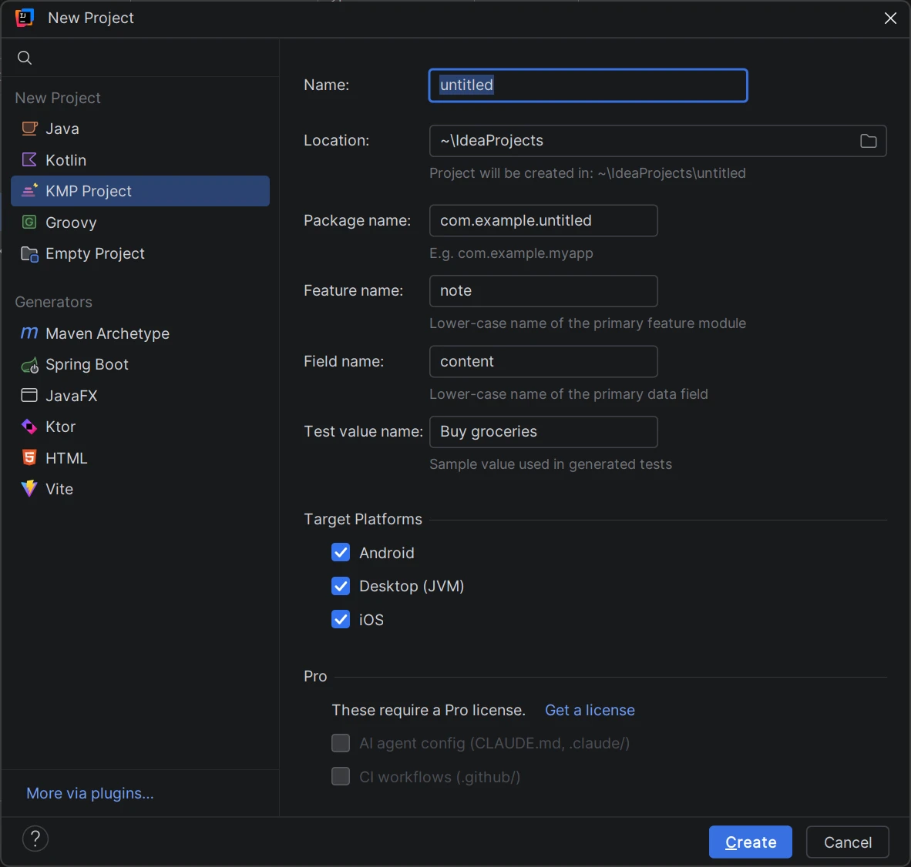

# KMP Project Wizard

[](https://plugins.jetbrains.com/plugin/31786)
[](https://plugins.jetbrains.com/plugin/31786)
[](LICENSE)
[](https://github.com/aoreshkov/kmp-wizard/actions/workflows/build.yml)

An IntelliJ IDEA plugin that generates opinionated, production-ready Kotlin
Multiplatform (KMP) projects for Android, Desktop, and iOS — straight from
**File → New → Project**. Website: [kmpwizard.oreshkov.app](https://kmpwizard.oreshkov.app/).



## What you get

Every generated project is a complete, buildable KMP app:

- **Compose Multiplatform** — shared UI across Android, Desktop (JVM), and iOS.
- **Navigation 3** — adaptive shell (bottom bar / rail / drawer via
  `NavigationSuiteScaffold`) with independent per-section back stacks.
- **Room 3** — local SQLite database with multiplatform support.
- **Settings & DataStore** — a Settings screen with Light/Dark/System theme,
  persisted with DataStore Preferences.
- **Koin Annotations** — lightweight, compile-time checked dependency injection.
- **Clean architecture** — modular `core:*` / `feature:*` layout with api/impl
  splits and domain, data, and UI layers.
- **Convention plugins** — centralized, maintainable Gradle build logic.
- **API guarding** — binary-compatibility-validator with committed API dumps.

### Free vs Pro

| Tier | What it includes |
| ---- | ---------------- |
| **Free** | Full project generation — everything listed above, for any combination of Android, Desktop, and iOS. |
| **Pro** | Additionally scaffolds an AI agent config (`CLAUDE.md`, `.claude/` review agents, skills, and hooks) and CI workflows (`.github/`) into the generated project. Requires a paid license via JetBrains Marketplace. |

## Installation

Install from [JetBrains Marketplace](https://plugins.jetbrains.com/plugin/31786):
**Settings → Plugins → Marketplace → search "KMP Project Wizard"**.

Requires IntelliJ IDEA 2026.1 or newer.

## Usage

1. Select **File → New → Project**.
2. Choose **KMP Project** from the generators list.
3. Configure the package name, feature name, data field name, test value, and
   target platforms (plus the Pro options if licensed).
4. Click **Create** — the project is generated and Gradle sync starts automatically.

## How it works

The plugin's internal templates are not hand-written — they are generated at
build time from a pinned release of
[kmp-ledger](https://github.com/aoreshkov/kmp-ledger), a real, working KMP
reference app (`ledgerVersion` in `gradle.properties`). Concrete names in the
ledger's sources are replaced with placeholders, and the wizard substitutes
them back with your values, so generated projects always match a public,
tagged state of the reference app.

To change **what generated projects look like**, contribute to
[kmp-ledger](https://github.com/aoreshkov/kmp-ledger); this repo only contains
the wizard itself. See [CONTRIBUTING.md](CONTRIBUTING.md) for details.

### Building from source

JDK 21 is required. The first build downloads the pinned kmp-ledger release
archive from GitHub; afterwards it is served from the Gradle cache and
`--offline` works.

```bash
./gradlew build     # compile + test
./gradlew runIde    # launch a sandbox IDE with the plugin loaded
```

## Releases

Versions follow the [CHANGELOG](CHANGELOG.md)
([Keep a Changelog](https://keepachangelog.com/en/1.1.0/) format) and are
published to [JetBrains Marketplace](https://plugins.jetbrains.com/plugin/31786),
with Marketplace change notes generated from the changelog at build time.

## Contributing & community

Bug reports, feature requests, and pull requests are welcome — see
[CONTRIBUTING.md](CONTRIBUTING.md) and use the issue templates when filing
bugs. This project follows a [Code of Conduct](CODE_OF_CONDUCT.md). Please
report security issues privately as described in [SECURITY.md](SECURITY.md).

## License

The **source code** in this repository is licensed under the [MIT License](LICENSE).

The **plugin as distributed** on JetBrains Marketplace (Free and Pro tiers) is
governed by its own [End User License Agreement](https://kmpwizard.oreshkov.app/license.html);
Pro features require a paid license key via the Marketplace.
